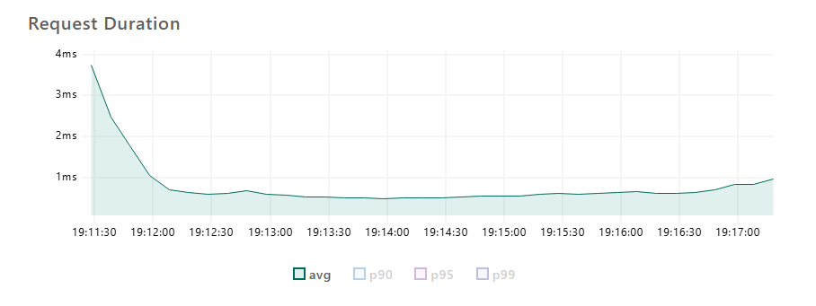

# Sistema de Orçamento e Rastreio da transportadora CargoBrasil

O projeto consiste em uma **API Rest** utilizando Springboot para funcionários e clientes da empresa CargoBrasil, **com testes de carga utilizando o [k6](https://k6.io/)**

## 1 Testes de carga com k6

## Serviço 1: POST /orcamento
**Tipo de operação:** inserção (escrita)
- **Arquivos envolvidos:**
    - [`src/main/java/.../api/OrcamentoController.java`](https://github.com/fabriciobcv/PI2-CargoBrasil/blob/main/app/src/main/java/com/pi2/cargobrasil/api/OrcamentoController.java)
    - [`src/main/java/.../service/OrcamentoService.java`](https://github.com/fabriciobcv/PI2-CargoBrasil/blob/main/app/src/main/java/com/pi2/cargobrasil/service/OrcamentoService.java)
    - [`src/main/java/.../domain/Orcamento.java`](https://github.com/fabriciobcv/PI2-CargoBrasil/blob/main/app/src/main/java/com/pi2/cargobrasil/domain/Orcamento.java)
    - [`src/main/java/.../domain/dto/OrcamentoDTO.java`](https://github.com/fabriciobcv/PI2-CargoBrasil/blob/main/app/src/main/java/com/pi2/cargobrasil/domain/dto/OrcamentoDTO.java)
    - [`src/main/java/.../api/OrcamentoConverter.java`](https://github.com/fabriciobcv/PI2-CargoBrasil/blob/main/app/src/main/java/com/pi2/cargobrasil/api/OrcamentoConverter.java)

- **Código de medição:**
    - [`/k6/orcamento-post-test.js`](https://github.com/fabriciobcv/PI2-CargoBrasil/blob/main/k6/orcamento-post-test.js)
    - [`/k6/orcamento-post.html`](https://github.com/fabriciobcv/PI2-CargoBrasil/blob/main/k6/orcamento-post.html)
    - [`/k6/orcamento-post-2.html`](https://github.com/fabriciobcv/PI2-CargoBrasil/blob/main/k6/orcamento-post-2.html)
- **Data da medição:** 07/07/2025
- **Configurações utilizadas:**
    - Máquina local: Windows 10, 16GB RAM, Java 17, Spring Boot 3, porta 8080
    - Banco de dados H2 Local
    - 0 → 600 usuários simultâneos, carga por 6 minutos

### Métricas:
#### 1º teste
- **Latência média:** 1.1 ms
- **Vazão:** 11.25 req/s
- **Concorrência máxima:** 20 VUs
- **Gráfico completo:** [orcamento-post.html](https://fabriciobcv.github.io/PI2-CargoBrasil/k6/orcamento-post.html)

### 2º teste
- **Latência média:** 593 µs
- **Vazão:** 224.65 req/s
- **Concorrência máxima:** 600 VUs
- **Gráfico completo:** [orcamento-post-2.html](https://fabriciobcv.github.io/PI2-CargoBrasil/k6/orcamento-post-2.html)

### Duração Média das Requisições
#### 1º teste

#### 2º teste

### Tempo Médio Bloqueado
#### 1º teste

#### 2º teste

### Vazão de Requisições
#### 1º teste

#### 2º teste

### Tempo Médio de Espera
#### 1º teste

#### 2º teste

### Requisições X Usuários simultâneos(VUs)
#### 1º teste

#### 2º teste

## Serviço 2: GET /orcamento
**Tipo de operação:** leitura
- **Arquivos envolvidos:**
  - [`src/main/java/.../api/OrcamentoController.java`](https://github.com/fabriciobcv/PI2-CargoBrasil/blob/main/app/src/main/java/com/pi2/cargobrasil/api/OrcamentoController.java)
  - [`src/main/java/.../service/OrcamentoService.java`](https://github.com/fabriciobcv/PI2-CargoBrasil/blob/main/app/src/main/java/com/pi2/cargobrasil/service/OrcamentoService.java)
  - [`src/main/java/.../domain/Orcamento.java`](https://github.com/fabriciobcv/PI2-CargoBrasil/blob/main/app/src/main/java/com/pi2/cargobrasil/domain/Orcamento.java)
  - [`src/main/java/.../domain/dto/OrcamentoDTO.java`](https://github.com/fabriciobcv/PI2-CargoBrasil/blob/main/app/src/main/java/com/pi2/cargobrasil/domain/dto/OrcamentoDTO.java)
  - [`src/main/java/.../api/OrcamentoConverter.java`](https://github.com/fabriciobcv/PI2-CargoBrasil/blob/main/app/src/main/java/com/pi2/cargobrasil/api/OrcamentoConverter.java)

- **Código de medição:**
  - [`/k6/orcamentos-get-test.js`](https://github.com/fabriciobcv/PI2-CargoBrasil/blob/main/k6/orcamentos-get-test.js)
  - [`/k6/orcamentos-get.html`](https://github.com/fabriciobcv/PI2-CargoBrasil/blob/main/k6/orcamentos-get.html)
- **Data da medição:** 29/06/2025
- **Configurações utilizadas:**
  - Máquina local: Windows 10, 16GB RAM, Java 17, Spring Boot 3, porta 8080
  - Banco de dados H2 Local
  - 0 → 400 usuários simultâneos, carga por 40 segundos

### Métricas:
#### 1º teste
- **Latência média:** 4.46 ms
- **Vazão:** 22.21 req/s
- **Concorrência máxima:** 20 VUs
- **Gráfico completo:** [orcamentos-get.html](https://fabriciobcv.github.io/PI2-CargoBrasil/k6/orcamentos-get.html)
#### 2º teste
- **Latência média:** 16.01 s
- **Vazão:** 5.39/s
- **Concorrência máxima:** 400 VUs
- **Gráfico completo:** [orcamentos-get-2.html](https://fabriciobcv.github.io/PI2-CargoBrasil/k6/orcamentos-get-2.html)

### Duração Média das Requisições
#### 1º teste

#### 2º teste

### Tempo Médio Bloqueado
#### 1º teste

#### 2º teste

### Vazão de Requisições
#### 1º teste

#### 2º teste

### Tempo Médio de Espera
#### 1º teste

#### 2º teste

### Requisições X Usuários simultâneos(VUs)
#### 1º teste

#### 2º teste
